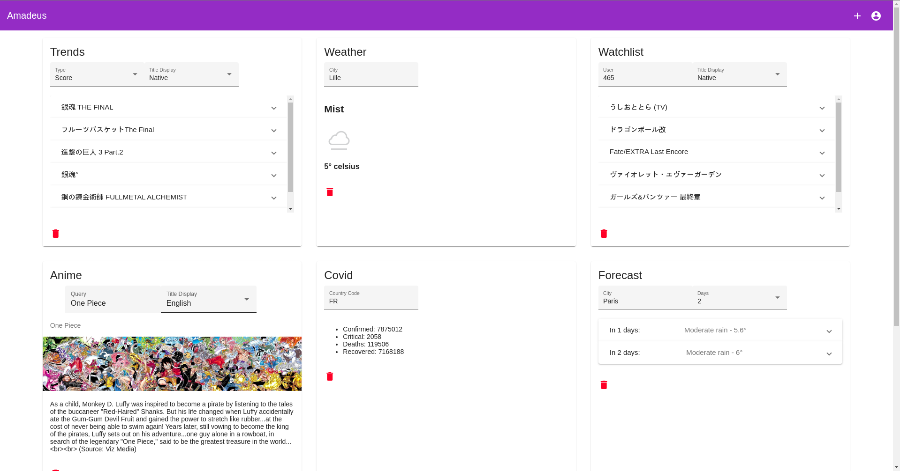
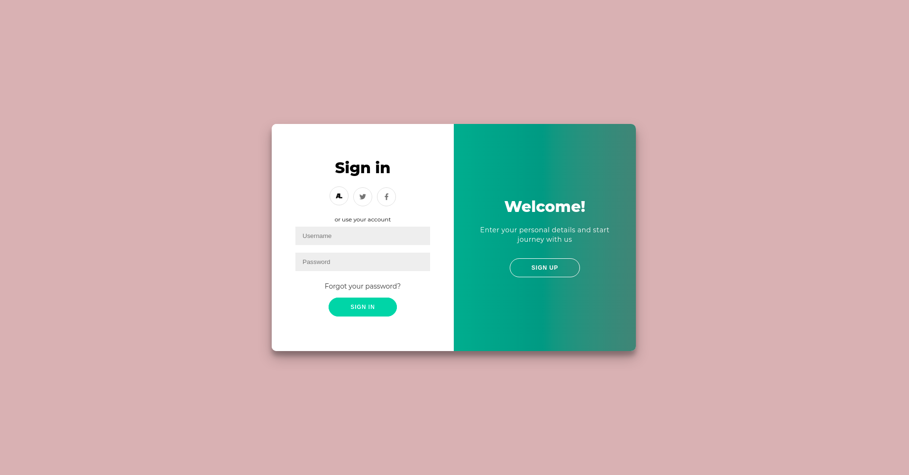

<p align="center">
    
</p>

# Amadeus
Amadeus is the a 3rd year Epitech project Dashboard.

Made with love by [@Clément Le Bihan](https://github.com/Octopus773) & [@Zoe Roux](https://github.com/AnonymusRaccoon)

Main repository: https://github.com/Octopus773/Amadeus

## In pictures



## Getting started

You will need:
 - docker
 - api keys as defined in "Services & Widget" section according to your needs

Clone this repository

Run this command at the root of the project
```bash
docker-compose up --build
```

The server is now running on `localhost:8080`
You can access the website on `localhost:8081`

## Services & Widget

3 services are available on Amadeus:
 - A weather service,
 - A covid service, and
 - An anime service (anilist)

Every service needs an API key to work properly. Api keys can be setup in the configuration file `appsettings.json` or by
specifing those environment variables:
 - WEATHERCONFIGURATION__APIKEY
 - COVIDCONFIGURATION__APIKEY
 - ANILISTOPTIONS__CLIENTID
 - ANILISTOPTIONS__CLIENTSECRET

The weather api key needs to be generated from [here](https://www.weatherapi.com/my/).
The covid api key from [here](https://rapidapi.com/Gramzivi/api/covid-19-data/).
And the anilist id and secrets from [here](https://anilist.co/home). During the configuration of this client, you need
to specify this url as the redirect url: http://localhost:8081/login/anilist

The weather service has two widgets:
 - The Weather widget which inform the current temperature and weather of a city
 - The Forecast widget which inform the temperature and weather of a city for the following days (between 1 and 3).

The Covid api has one widget. This widget give information about the covid situation of a country given it's code or if no
code is given, the global covid situation is given.

The anilist widget has three widgets.
 - The watchlist widget which display the watchlist of the currently authenticated user or of any other user given it's
 name or ID.
 - The show detail widget which display the picture, name and description of a searched show.
 - The trending page which display the most popular shows of the moment.

## Documentation
[Here](https://octopus773.github.io/Amadeus/)

## Technical stack
- Backend: C#
- Frontend: Angular